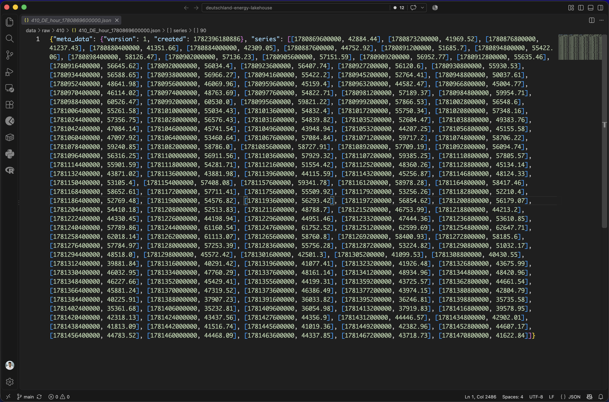
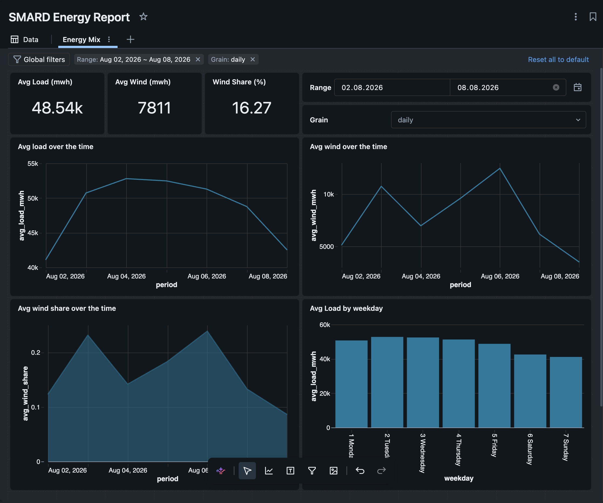

# Deutschland energy lakehouse

SMARD publishes German electricity as awkward JSON. This repo turns about 90 days of **load** and **onshore wind** into Delta tables and a Databricks dashboard.

## From raw JSON to the report

<table>
  <tr>
    <td align="center">
      <strong>Before — raw SMARD JSON</strong> 
      
    </td>
    <td align="center">
      <strong>After — gold dashboard</strong> 
      
    </td>
  </tr>
</table>

Raw files keep millisecond timestamps and `null` hours. Gold is one row per day (load, wind, wind share) that the dashboard filters by date and daily/weekly grain.

## Medallion
- `bronze.smard_raw` — raw hourly JSON (timestamps as ms, nulls kept)
- `silver.electricity_hourly` — Europe/Berlin time, typed metrics, duplicates dropped
- `gold.daily_load` — one row per day, load min/avg/max
- `gold.daily_energy_mix` — daily load vs wind and wind share of load (hours without load dropped)

## How to run
1. `python ingest/smard_ingest.py` (laptop) → `data/raw/` (gitignored)
2. Upload JSON to Databricks volume `bronze.landing`
3. Run notebook `notebooks/01_bronze`
4. Dashboard reads gold: date range and daily/weekly/yearly grain are SQL parameters

Kurz: Ingest auf dem Laptop, Spark im Notebook, Report im Dashboard. Bronze roh, Silver geputzt, Gold der Tages-Report.